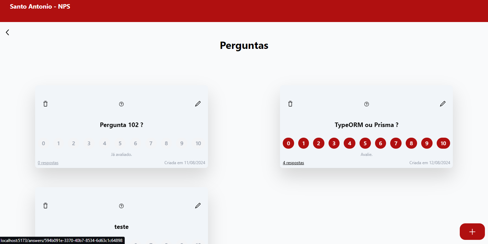

# NPS (Net Promoter Score)

<div align="center">
  
</div>

## Descrição
Teste dado pela loja santo antonio com objetivo de fazer um NPS com canais, perguntas e respostas. A funcionalidade é criar deletar editar e alterar canais, perguntas e repostas e avaliar perguntas

# API

 ## Ferramentes da API
  - TypeScript
  - Nest.js
  - Prisma
  - Swagger
  - Docker
  - Redis
  - PostgreSQL
  - Nodev20.14

## Variável de ambiente
Crie o `.env` e seguindo o exemplo do `.env.example`

```bash
DATABASE_URL
```


## Rodando a API
#### Clone
```bash
$ git clone https://github.com/Micalli/S.Antonio-NPS-API.git && S.Antonio-NPS-API
```
#### Rodando PostgreSQL com Docker
```bash
docker run --name pg -e POSTGRES_USER=root -e POSTGRES_PASSWORD=root -p 5432:5432 -d postgres
```

#### Instalação da depedencias

```bash
$ yarn install
```

```bash
# development
$ yarn run start

# watch mode
$ yarn run start:dev

# production mode
$ yarn run start:prod
```

## Swagger
Com a API rodando acesse o link [SwaggerLink(http://localhost:3000/api)](http://localhost:3000/api)

# Front

 ## Ferramentes do APP
  - TypeScript
  - React
  - Router
  - Tailwind
  - HTML
  - CSS
  - Vite
  - Radix

## Rodando a API
#### Clone
```bash
$ git clone https://github.com/Micalli/S.Antonio-NPS-API.git && S.Antonio-NPS-FE
```

#### Instalação da depedencias

```bash
$ yarn install
```
#### Rodando

```bash
# development
$ yarn dev
```

## Entre em contato

- Author - [Micalli](https://www.linkedin.com/in/brunomicalli/)
